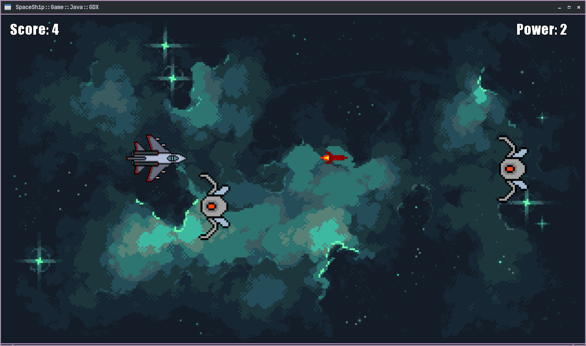

# 🚀 SpaceShip
> A basic game made with Java and [LibGDX](https://github.com/libgdx/libgdx).

---

# ☕ This game was created in this Youtube series:
## <https://cutt.ly/javagdx>

---

 

---

# ⚙️  Dependencies
+ [OpenJDK](https://github.com/openjdk)
+ [Gradle](https://github.com/gradle/gradle)

---

# 🎮 How to play
```bash
git clone https://github.com/terroo/spaceship
cd spaceship
gradle run
```

---

# ▶️  All videos in the series
1. <https://www.youtube.com/watch?v=2bmvlwvnirk>
2. <https://www.youtube.com/watch?v=2furs-8L1-8>
3. <https://www.youtube.com/watch?v=5k-2TAy8JUA>
4. <https://youtu.be/oYsA9PGCkQA>

---
